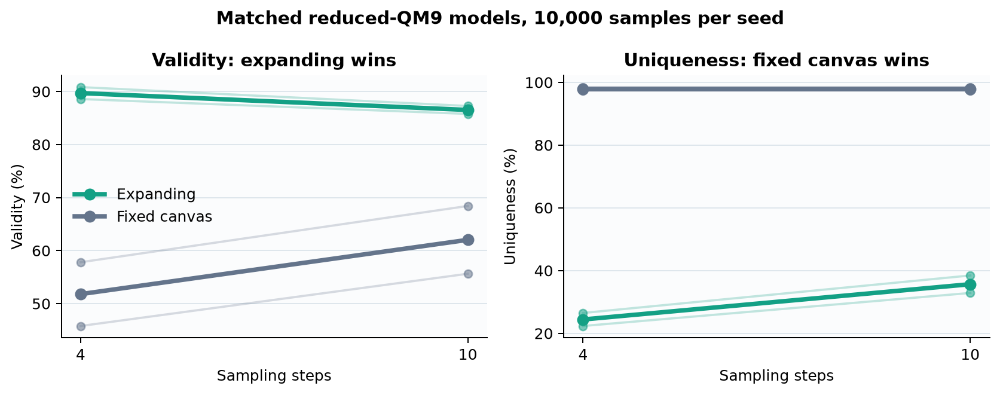
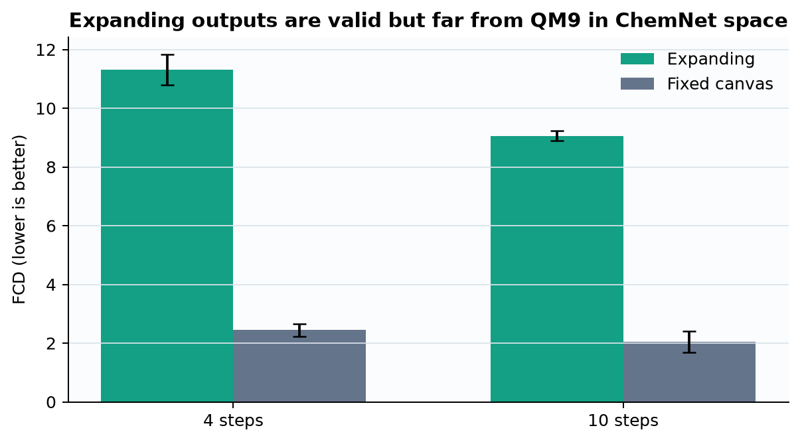
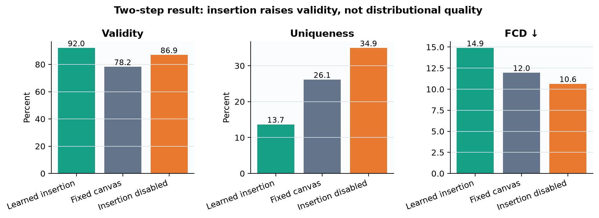
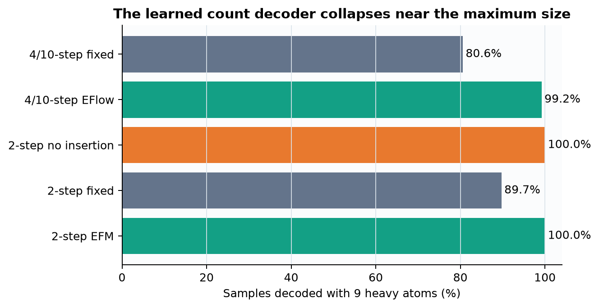

# Expanding Flow Maps on reduced QM9

Molecule generators must decide both what a molecule contains and how large it should be. *Expanding Flow Maps* proposes building a molecule by learning when to insert new atoms, instead of denoising a fixed maximum-size canvas; this reproduction tests whether that idea still helps when sampling is restricted to only a few updates. We trained small matched models from scratch on public QM9 and measured chemical validity, diversity, and similarity to the dataset.

## Verdict

**Partially reproduced.** On this bounded implementation, expansion retained much higher validity at four and ten steps, aligning with one part of the headline claim. It did **not** retain higher uniqueness, did not improve Fréchet ChemNet Distance (FCD), and its distilled two-step version was worse than the fixed canvas on FCD in both seeds; disabling insertion improved FCD rather than removing an advantage.

**How to read this figure.** Thick lines are two-seed means and faint lines are individual seeds; every point evaluates 10,000 generated molecules. At four steps, expanding flow reached 89.7% validity versus 51.8% for fixed canvas, but only 24.4% of its valid molecules were unique versus 97.9%. More steps did not reverse that trade-off.

Molab opens the evidence-filled notebook directly: https://molab.marimo.io/github/alphaXiv/rabbit-hole-f78fc7b3/blob/main/notebooks/qm9_reproduction.py

## What was tested

The paper reports that its expanding discrete flow remains effective at tiny step budgets, where a fixed-canvas discrete flow deteriorates. Its QM9 table gives EFlow versus DeFoG validity/uniqueness of 91.7/92.8% versus 53.6/63.1% at four steps, and 97.9/96.1% versus 88.6/92.8% at ten. It also reports two-step distilled EFM versus fixed CFM FCD of 0.40 versus 0.49, with learned insertion supplying the advantage.

We preserved the named public benchmark and metrics. The implementation downloads DeepChem’s public QM9 table (SHA-256 `3e668f8c34e4bc39…`), uses RDKit validity and uniqueness, and computes FCD with the public `fcd_torch` ChemNet model. Each condition uses the same 20,000/2,000/2,000 split, 10,000 generated samples, two seeds, and four GPUs.

| Claim | Paper | Observed mean across seeds | Assessment |
|---|---|---|---|
| Four-step expansion | validity 91.7 vs 53.6%; uniqueness 92.8 vs 63.1% | validity 89.7 vs 51.8%; uniqueness 24.4 vs 97.9% | Validity aligned; uniqueness diverged |
| Ten-step expansion | validity 97.9 vs 88.6%; uniqueness 96.1 vs 92.8% | validity 86.5 vs 62.0%; uniqueness 35.7 vs 97.9% | Validity ordering aligned; uniqueness diverged |
| Two-step map | FCD 0.40 vs 0.49 | FCD 14.89 vs 11.95 | Opposite ordering in both seeds |
| Remove insertion | removes EFM advantage | FCD improved from 14.89 to 10.64 | Opposite mechanism result |

## Small but matched implementation

The expanding path begins from an empty graph. It assigns each active node a local time, corrupts categorical atom and bond states, and predicts atom types, bonds, the next gap, and node count with one shared six-layer graph transformer. The fixed control exposes nine positions from the start, adds a padding atom category, uses global time, and otherwise matches capacity, optimizer, training steps, and decoding.

This is a deliberate scale reduction, not a synthetic proxy: 20K training molecules and 30K updates replace the paper’s 100K split, nine-layer network, and two million updates. Distillation trains each teacher for 30K updates, initializes a student from it, then applies 10K two-time consistency updates. No author implementation was public, so loss weighting and time parameterization are explicit substitutions documented in `src/run_experiment.py`.

## Distributional quality contradicts validity

FCD is lower when generated molecules resemble QM9 in ChemNet’s learned feature space. Expansion averaged 11.31 versus 2.44 at four steps and 9.06 versus 2.05 at ten. Thus the valid structures produced by the expanding model were much farther from the reference distribution; the effect appeared in both seeds, not just in the average.

## Two-step distillation and insertion

Two-step EFM averaged 92.0% validity, exceeding the fixed map’s 78.2%, but its FCD was 2.93 points worse and uniqueness 12.5 points lower. Disabling insertion reduced validity by 5.1 points, yet improved FCD by 4.25 and uniqueness by 21.3 points relative to learned insertion. Seedwise FCD changed from 16.17 to 11.47 and from 13.61 to 9.81, so the ablation direction was consistent.

The main diagnostic is count collapse. Both distilled EFM seeds decoded every sample at the maximum nine heavy atoms; the multi-step expanding runs did so for 99.2% on average. This explains how validity can stay high while uniqueness and FCD deteriorate, and cautions that the result tests this implementation of expansion rather than the paper’s full training recipe.

## Assessment and limits

The reduced campaign supports the narrow mechanistic observation that an expanding representation can protect validity at very small step budgets. It does not support the stronger joint claim of validity **and** uniqueness, the two-step FCD advantage, or the claimed insertion mechanism under these substitutions. A full reproduction still needs the authors’ exact loss/time schedule, 100K training split, nine-layer model, two million updates, and broader seeds.

All evidence ran on **Kubernetes** with **NVIDIA RTX PRO 6000 Blackwell** GPUs, peaking at **16 concurrent GPUs**. The fresh campaign’s actual elapsed wall time was **1.178 hours**, from the first formal launch at 04:12:18 UTC to the last terminal run at 05:22:59 UTC; individual matched runs took about 8.8–12.1 minutes on four GPUs. Exact measurements and provenance are in `results/qm9_results.csv`; code-bearing branches are linked from the repository README.
